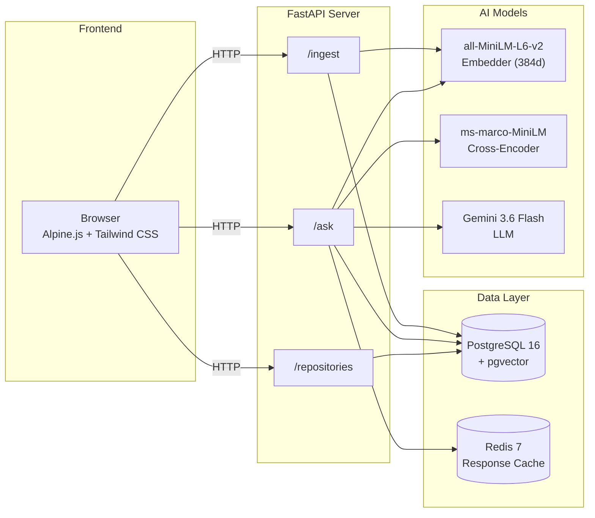
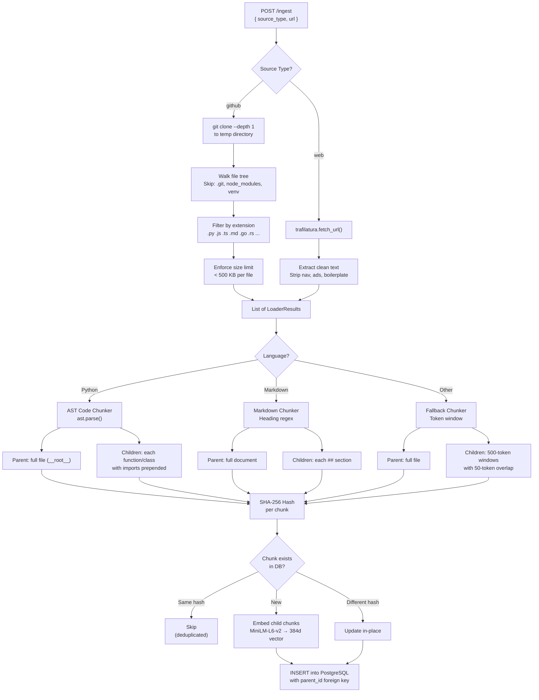
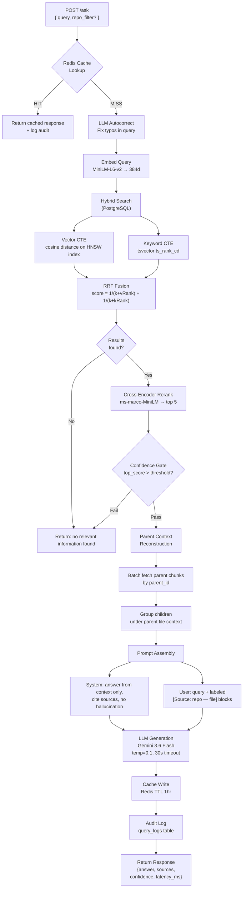

# CodeLens — AI Developer Knowledge Assistant


An AI-powered developer knowledge assistant that indexes GitHub repositories, documentation websites, and Markdown docs, then answers natural-language questions with grounded, cited responses.

Built with **Advanced RAG** (Retrieval-Augmented Generation) — not just basic vector search, but a multi-stage pipeline combining hybrid retrieval (RRF), cross-encoder re-ranking, confidence gating, AST-aware code chunking, and LLM-powered query autocorrect. Each stage is independently benchmarked to prove it improves answer quality.

---

## ✨ Features

- 🔍 **Hybrid Search** — Combines vector similarity (pgvector) with keyword matching (tsvector) using Reciprocal Rank Fusion
- 🎯 **Cross-Encoder Re-ranking** — ms-marco MiniLM re-scores results for precision
- 🛡️ **Confidence Gating** — Rejects low-quality retrievals instead of hallucinating
- 🧬 **AST-Aware Code Chunking** — Splits Python files at function/class boundaries, not arbitrary line counts
- 📦 **Parent-Child Chunks** — Retrieves focused child chunks but reconstructs full parent context for the LLM
- ⚡ **Redis Caching** — Caches repeated queries with graceful degradation if Redis is down
- 🔄 **SHA-256 Deduplication** — Re-ingesting a repo skips unchanged files automatically
- 🌐 **Multi-Source Ingestion** — GitHub repos, documentation websites, and local Markdown files
- 🧠 **LLM Query Autocorrect** — Fixes typos in user queries before embedding to prevent retrieval failures
- 🖥️ **Modern Chat UI** — Dark-mode frontend built with Alpine.js and Tailwind CSS, with inline source citations
- 🗑️ **Repository Management** — List, filter, and delete indexed data sources via API and UI
- 📊 **Query Audit Logging** — Every query is logged with retrieval IDs, confidence scores, and latency breakdowns

---

## 🏗️ System Architecture



---

## 📥 Ingestion Pipeline

How CodeLens processes and stores a new data source:



---

## 🔎 Query Pipeline

How CodeLens answers a question end-to-end:



---

## Tech Stack

| Layer | Technology |
|-------|------------|
| **API** | FastAPI (Python 3.11+) |
| **Database** | PostgreSQL 16 + pgvector (HNSW index) |
| **Embeddings** | sentence-transformers (all-MiniLM-L6-v2, 384d) |
| **Re-ranking** | cross-encoder/ms-marco-MiniLM-L-6-v2 |
| **Cache** | Redis 7 |
| **LLM** | Gemini / OpenAI / Anthropic (provider-agnostic) |
| **Frontend** | Alpine.js + Tailwind CSS + marked.js |
| **Web Scraping** | trafilatura |
| **Containerization** | Docker Compose (PostgreSQL + Redis) |

---

## 🚀 Quick Start

```bash
# 1. Clone
git clone https://github.com/Anuj0725/CodeLens.git
cd CodeLens

# 2. Create virtual environment
python -m venv venv
.\venv\Scripts\activate   # Windows
# source venv/bin/activate  # Linux/Mac

# 3. Install dependencies
pip install -r requirements.txt

# 4. Start Postgres + Redis
docker compose up -d

# 5. Configure
cp .env.example .env
# Edit .env — add your Gemini API key (get one at https://aistudio.google.com/apikey)

# 6. Run the API server
uvicorn codelens.api.main:app --reload

# 7. Open the UI
# Open frontend/index.html in your browser
```

---

## 📡 API Reference

| Method | Path | Description |
|--------|------|-------------|
| `GET` | `/health` | Health check |
| `POST` | `/ingest` | Index a GitHub repo or website |
| `POST` | `/ask` | Query the knowledge base |
| `GET` | `/repositories` | List all indexed data sources |
| `DELETE` | `/repositories/{path}` | Delete an indexed data source |

### POST /ingest

Index a GitHub repository:
```json
{
  "source_type": "github",
  "url": "https://github.com/pallets/markupsafe"
}
```

Index a website:
```json
{
  "source_type": "web",
  "url": "https://en.wikipedia.org/wiki/Data_structure"
}
```

### POST /ask
```json
{
  "query": "How does the Markup class escape HTML?",
  "repo_filter": "pallets/markupsafe"
}
```

**Response:**
```json
{
  "answer": "The `escape()` function converts special HTML characters...",
  "confidence_score": -0.78,
  "sources": [
    {"file_path": "src/markupsafe/__init__.py", "chunk_identifier": "escape"},
    {"file_path": "README.md", "chunk_identifier": "## Examples"}
  ],
  "cache_hit": false,
  "latency_ms": {"retrieval": 42, "rerank": 105, "generation": 2937, "total": 3200}
}
```

### GET /repositories
```json
{
  "repositories": [
    "pallets/markupsafe",
    "https://en.wikipedia.org/wiki/Data_structure"
  ]
}
```

### DELETE /repositories/{path}
```json
{
  "message": "Successfully deleted pallets/markupsafe",
  "chunks_deleted": 115
}
```

---

## 📊 Benchmark Results

Evaluated on 25 hand-labeled questions against `pallets/markupsafe` (115 chunks), covering code-specific, conceptual, and exact-match query types:

| Metric | Keyword | Vector | Hybrid | Hybrid+Rerank |
|--------|---------|--------|--------|---------------|
| Precision@5 | 0.000 | 0.080 | 0.080 | **0.096** |
| Recall@5 | 0.000 | 0.320 | 0.320 | **0.400** |
| MRR | 0.000 | 0.291 | 0.289 | **0.361** |

Each pipeline stage adds measurable value: pure keyword search fails entirely on natural-language questions. Vector search establishes a baseline. Hybrid RRF maintains vector quality while adding keyword coverage. The cross-encoder reranker delivers the largest single improvement — **+25% Recall@5** and **+24% MRR** over raw hybrid results, especially on exact-match queries (Recall@5: 0.60).

---

## 📁 Project Structure

```
CodeLens/
├── codelens/
│   ├── api/              # FastAPI endpoints (health, ingest, ask, repos)
│   ├── cache/            # Redis response cache + query audit logger
│   ├── chunking/         # AST code, markdown, and fallback chunkers
│   ├── generation/       # LLM client (multi-provider) + prompt builder
│   ├── indexing/         # Embedder, SHA-256 hasher, ingestion pipeline
│   ├── loaders/          # GitHub, web, and markdown file loaders
│   ├── retrieval/        # Hybrid search, cross-encoder reranker, confidence gate
│   ├── config.py         # Pydantic settings from .env
│   ├── database.py       # asyncpg connection pool
│   └── query_engine.py   # End-to-end RAG pipeline orchestrator
├── frontend/
│   ├── index.html        # Chat UI (Alpine.js + Tailwind CSS)
│   ├── app.js            # Frontend logic and API integration
│   └── style.css         # Custom dark theme overrides
├── eval/
│   ├── test_questions.json  # 25 labeled evaluation questions
│   └── benchmark.py         # Retrieval quality benchmark
├── sql/
│   ├── schema.sql        # PostgreSQL + pgvector table definitions
│   └── rrf.sql           # Standalone RRF query reference
├── tests/                # Unit tests (pytest)
├── docker-compose.yml    # PostgreSQL + Redis containers
└── requirements.txt
```

---

## 🧪 Testing

```bash
pytest tests/ -v
```

---

<div align="center">

### 👨‍💻 Author

**Anuj Madhani**

Built as a deep-dive into production RAG systems — from AST-aware chunking to cross-encoder reranking.

[](https://github.com/Anuj0725)

---

📄 Licensed under **MIT** · © 2026 Anuj Madhani

</div>
